# 요리왕천재

한 키보드로 2명이 겨루는 60초 요리 대결 게임을 만들었음.

- 개발 기간: 2026.05.08 ~ 2026.05.17
- 전시: 2026.05.18 ~ 2026.05.19
- 구분: LEVEL 0 제1회 게임잼 팀 프로젝트
- 팀명: 조아요 수집가
- 구성: 개발 2명, 아트 2명
- 담당: 게임 진행, 채점, 인벤토리, 카드, 사운드와 대화 기능
- 기준 해상도: 1920×1080 FHD
- 기술: Unity 6, C#

## 게임 설명

- 바구니를 처음 열면 재료를 확인하고 두 번째에 획득하는 방식임.
- 필요한 재료를 모아 요리를 완성하면 0점부터 100점까지 자동 채점함.
- 암전, 조작 반전, 곰팡이, MSG 같은 카드로 상대를 방해할 수 있음.

아래 화면은 게임이 기준으로 잡은 1920×1080 해상도로 실행해 캡처했음.

| 손님의 주문 확인 | 바구니 속 재료 확인 |
| --- | --- |
| 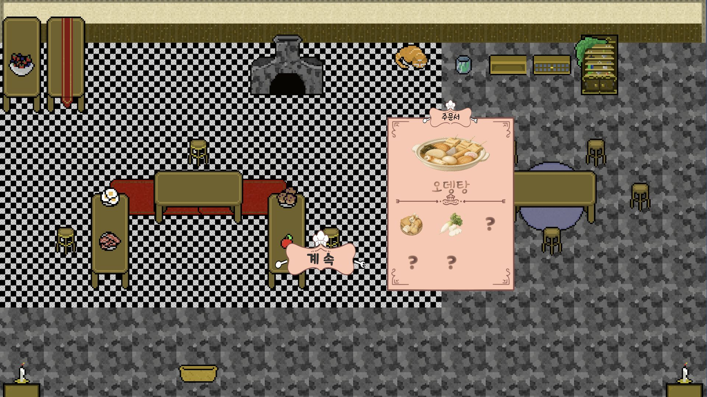 | 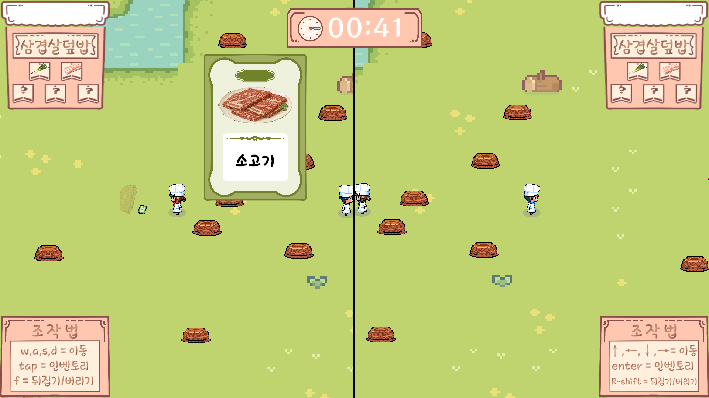 |

## 카드 구성

### 재료 카드 10종

<table>
  <tr>
    <td align="center">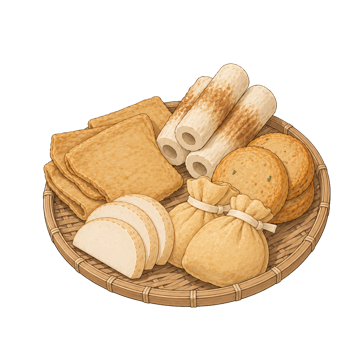 오뎅</td>
    <td align="center">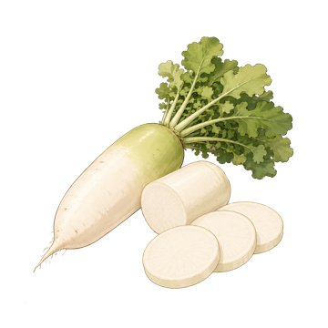 무</td>
    <td align="center">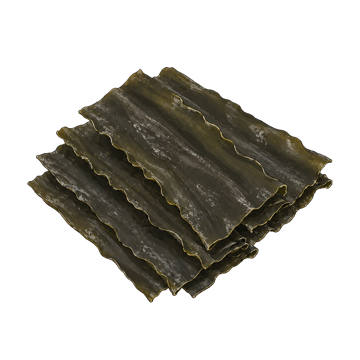 다시마</td>
    <td align="center">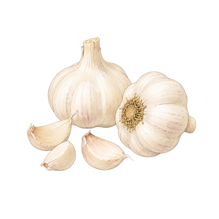 마늘</td>
    <td align="center">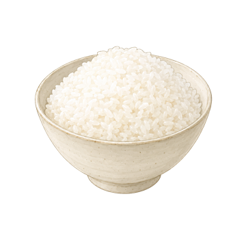 밥</td>
  </tr>
  <tr>
    <td align="center"> 간장</td>
    <td align="center"> 설탕</td>
    <td align="center">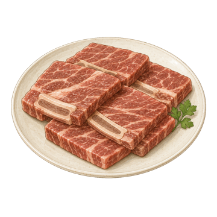 소고기</td>
    <td align="center">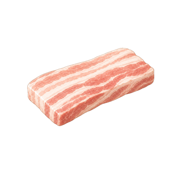 삼겹살</td>
    <td align="center">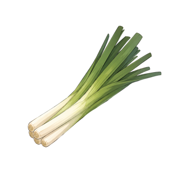 대파</td>
  </tr>
</table>

### 능력 카드 10종

<table>
  <tr>
    <td align="center"> 암전</td>
    <td align="center"> 조작 반전</td>
    <td align="center">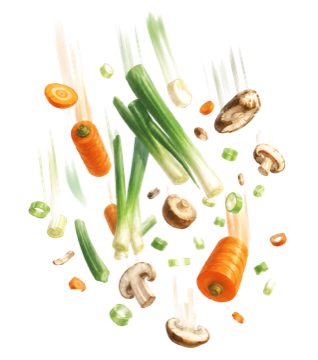 재료 흘리기</td>
    <td align="center">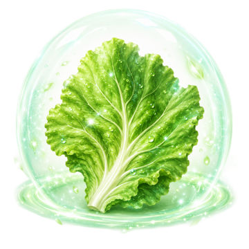 신선 보호막</td>
    <td align="center"> MSG</td>
  </tr>
  <tr>
    <td align="center">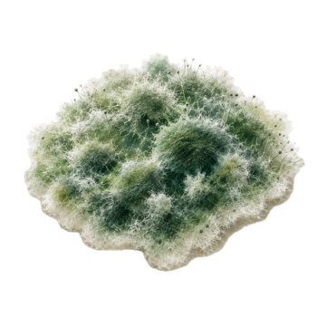 곰팡이</td>
    <td align="center"> 로켓 바구니</td>
    <td align="center">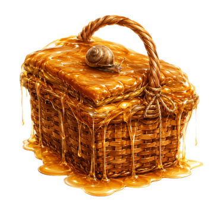 느림보 바구니</td>
    <td align="center"> 멍 때리기</td>
    <td align="center">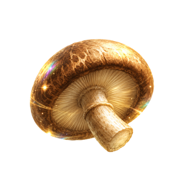 만능 재료</td>
  </tr>
</table>

| 카드 | 실제 효과 |
| --- | --- |
| 암전 | 상대 화면을 3초간 가림 |
| 조작 반전 | 상대 이동 방향을 3초간 반대로 바꿈 |
| 재료 흘리기 | 상대 재료 1개를 떨어뜨림 |
| 신선 보호막 | 다음 곰팡이 효과를 1회 막음 |
| MSG | 요리 점수에 5점을 더함 |
| 곰팡이 | 상대 재료 1개를 썩은 재료로 바꿈 |
| 로켓 바구니 | 내 이동 속도를 5초간 2배로 올림 |
| 느림보 바구니 | 상대 이동 속도를 3초간 40%로 낮춤 |
| 멍 때리기 | 상대를 1초간 움직이지 못하게 함 |
| 만능 재료 | 요리할 때 부족한 재료 1개를 대신함 |

### 능력 발동 예시

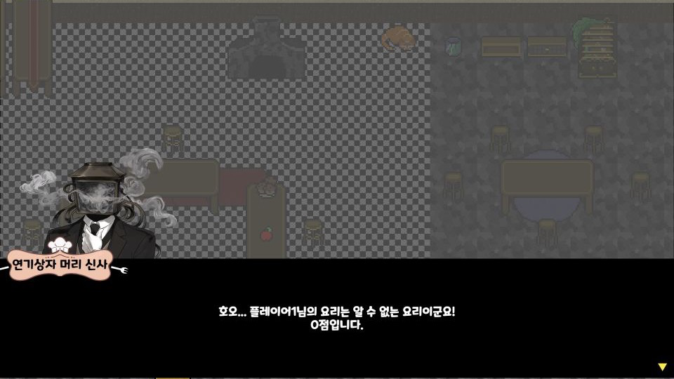

- 실제 플레이 중 암전 카드를 획득해 2P 화면이 가려지고 카드 알림이 뜬 장면임.

## 내가 맡은 부분과 구현 방식

- `GamePhaseManager`에서 시작, 튜토리얼, 재료 수집, 요리와 결과 순서를 관리했음.
- 레시피 선택, 힌트와 재료 조합에 따른 0~100점 채점 기능을 만들었음.
- 5칸 인벤토리와 재료 교체 기능을 구현했음.
- 카드, 재료와 레시피는 `ScriptableObject`로 나눠 수치를 쉽게 바꿀 수 있게 했음.
- `Physics2D.OverlapCircleAll`로 주변 바구니를 찾아 확인과 획득을 처리했음.
- 플레이어별 카메라와 Canvas를 나눠 한 화면에서 2명이 플레이할 수 있게 했음.
- `SoundManager`로 BGM과 효과음을 나눠 재생하고 대화창과 타자 효과도 추가했음.
- 게임 기획서 작성에도 참여했음.

## 진행 결과

- 게임을 완성해 게임잼에 제출했음.
- 플레이 피드백을 받고 2P 줍기 키를 `L`에서 `Right Shift`로 바꿨음.
- 게임잼 페이지: [LEVEL 0 제1회 게임잼](https://itch.io/jam/level0-firstjam-gaenojam)

## 조작

- 1P: `WASD` 이동, `F` 바구니, `Tab` 인벤토리
- 2P: 방향키 이동, `Right Shift` 바구니, `Enter` 인벤토리
