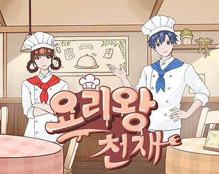
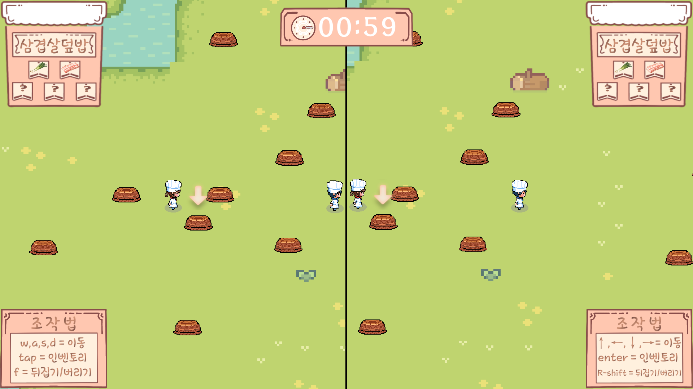

# 요리왕천재 (Cooking King)

> 한 키보드로 2명이 겨루는 60초 요리 대결 파티게임 — 게임잼 완성작

## 게임 소개

두 플레이어가 같은 키보드에서 동시에 플레이합니다. 60초 안에 바구니를 뒤져 레시피 재료를 모으고, 요리를 완성하면 0~100점으로 자동 채점됩니다. 바구니는 1회차에 내용물을 훔쳐보고(peek), 2회차에 획득(collect)하는 구조라 기억력과 동선 싸움이 벌어집니다. 여기에 암전·조작반전·곰팡이·MSG 등 **특수카드 10종**으로 상대를 방해할 수 있습니다.

- **장르**: 로컬 2인 경쟁 파티 게임
- **엔진**: Unity 6 (6000.3.15f), 2D URP, 1920×1080 스플릿 스크린
- **팀**: 조아요 수집가 — 개발 2 / 아트 2 (게임잼 출품, 스마일게이트 멤버십 지원 제출)

## 조작법

| | 플레이어 1 | 플레이어 2 |
|--|-----------|-----------|
| 이동 | W A S D | 방향키 |
| 바구니 열기 / 줍기 | F | Right Shift |
| 인벤토리 | Tab | Enter |
| 카드 탐색 | A / D | ← / → |

## 담당 역할 — 강유민 (프로그래밍, 커밋 12개 중 8개)

- **게임 페이즈 상태머신** (`GamePhaseManager`) — Start → Tutorial → MenuSelection → Farming → Cooking → Result 흐름 제어
- **채점 시스템** (`ScoringSystem`) + 레시피 랜덤 선택·힌트 생성 (`RecipeManager`)
- **인벤토리** — 5슬롯 + 가득 찼을 때 교체 모드 (`Inventory`, `InventoryUI`)
- **특수카드 데이터 설계** — `ScriptableObject`(`SpecialCardSO`)로 카드 10종을 데이터로 분리, 기획자가 코드 수정 없이 밸런싱 가능
- **사운드 시스템** — BGM/SFX 분리 싱글톤 `SoundManager` + 에디터 확장(`Tools → Setup SoundManager`)으로 클립 자동 할당
- **비주얼노벨 대화 시스템** (`DialogueManager`) — 타자 효과 + 폰트 자동 축소
- 게임 기획서 작성

## 만들면서 부딪힌 문제와 해결

**1. 이름표 밖으로 삐져나가는 긴 텍스트** — 캐릭터 이름·대사 길이가 제각각이라 TMP 텍스트가 UI 스프라이트를 벗어났습니다. 가정으로 고치려다 세 번 헛돌고, `Debug.Log`로 실측값(컨테이너 너비, naturalWidth, fontSize)을 먼저 찍는 방식으로 전환 — `ForceMeshUpdate()`로 렌더 전 실제 폭을 계산해 기준 폭 초과 시에만 폰트를 비례 축소하는 자동화로 해결했습니다.

**2. 재시작하면 이전 판 인벤토리가 남는 버그** — 씬 리로드 없이 `ChangePhase(Start)`만 호출하는 구조라 상태가 자동 초기화되지 않았습니다. `Inventory.ResetInventory()`를 만들어 재시작 훅에 연결하고, 이후 "새 상태값을 추가하면 초기화 지점도 함께 추가"를 팀 규칙으로 만들었습니다.

**3. 한 키보드 2인 입력 충돌** — 플레이테스트에서 플레이어2의 줍기 키(L)가 이동키와 손이 겹친다는 피드백을 받아 Right Shift로 교체했습니다. Unity 씬/프리팹의 KeyCode가 숫자로 직렬화되는 점(L=108, RightShift=303)을 이용해 씬 파일을 직접 수정해 반영했습니다.

## 협업 방식

`feat/yumin`, `feat/hankyul` 브랜치 → Pull Request → 리뷰 후 머지. 아트 2인과는 스프라이트 규격(해상도·피벗)을 먼저 합의하고 작업했습니다.
